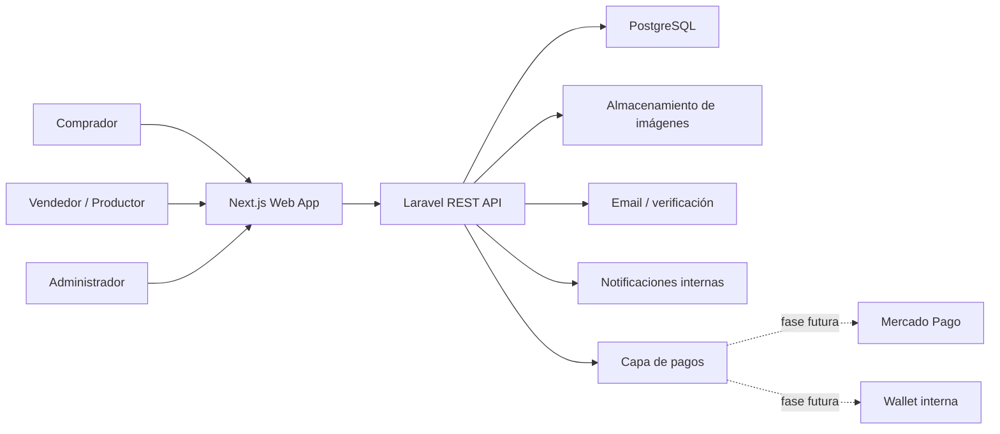
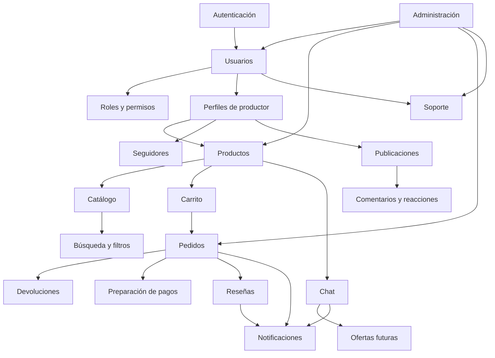

# Diseño de Alto Nivel (HLD) - Mercado Ahora

## 1. Objetivo del documento

Este documento define la arquitectura general de Mercado Ahora para las Fases 1, 2 y 3 del proyecto. Su objetivo es dejar clara la visión técnica, los componentes principales del sistema, la relación entre frontend, backend, base de datos e integraciones futuras.

El HLD no baja al detalle de implementación de cada función. Ese nivel se cubre en el documento LLD, diseño de base de datos y estructura de API.

## 2. Resumen del producto

Mercado Ahora es un marketplace orientado a productos argentinos, naturales, agroecológicos, artesanales, regionales y sustentables. La plataforma conecta compradores con productores, emprendedores, cooperativas, pequeños fabricantes y vendedores locales.

La propuesta no se limita a comprar y vender. El diferencial del proyecto es generar confianza entre comprador y productor mediante perfiles, historia del productor, contacto directo, reseñas, publicaciones y comunidad.

Principio principal de experiencia:

```text
Conocer al productor -> generar confianza -> consultar -> comprar -> mantener relación
```

## 3. Alcance por fases

### Fase 1 - MVP

Duración estimada: 10 semanas.

Objetivo: construir la base funcional del marketplace para validar si los productores publican productos y si los compradores pueden descubrir, consultar y comprar.

Incluye:

- Registro y acceso de compradores, vendedores y administradores.
- Perfil básico de vendedor/productor.
- Publicación de productos por vendedor.
- Catálogo con categorías y subcategorías.
- Página de producto.
- Chat básico comprador-productor.
- Estructura de pagos preparada, sin integración completa de Mercado Pago en MVP.
- Flujo de compra por "Comprar ahora" y carrito.
- Creación de pedidos.
- Gestión básica de órdenes y devoluciones.
- Panel administrativo básico.

### Fase 2 - Mejora de experiencia

Duración estimada: 4 semanas.

Objetivo: mejorar confianza, usabilidad y soporte después del MVP.

Incluye:

- Reseñas y calificaciones.
- Centro de notificaciones.
- Sistema de soporte.
- Búsqueda y filtros avanzados.

### Fase 3 - Comunidad y diferenciación

Duración estimada: 4 semanas.

Objetivo: convertir el marketplace en un espacio de relación entre productores y compradores.

Incluye:

- Seguidores de productores.
- Publicaciones/novedades de productores.
- Comentarios y reacciones personalizadas.
- Integración entre comunidad y notificaciones.

## 4. Stack tecnológico

### Frontend

- Next.js con App Router.
- TypeScript.
- Tailwind CSS.
- Diseño responsive mobile-first.
- Consumo de API REST del backend Laravel.

### Backend

- Laravel.
- API REST.
- Autenticación y autorización por roles.
- Validaciones server-side.
- Políticas de acceso por recurso.
- Estructura preparada para colas, eventos e integraciones.

### Base de datos

- PostgreSQL.
- Modelo relacional.
- Índices para consultas frecuentes.
- Diseño preparado para escalar catálogo, órdenes, reseñas, notificaciones y comunidad.

### Infraestructura inicial

- VPS como primer entorno de despliegue.
- Posibilidad de evolucionar luego a Docker, workers, cache, balanceo y servicios separados.

## 5. Vista general del sistema



## 6. Componentes principales

### Aplicación web

Responsable de mostrar la experiencia de usuario:

- Home.
- Categorías.
- Resultados de búsqueda.
- Página de producto.
- Perfil del productor.
- Carrito.
- Checkout.
- Seguimiento de pedido.
- Panel del productor.
- Panel administrador.
- Notificaciones.
- Soporte.
- Comunidad.

### API backend

Responsable de la lógica de negocio:

- Usuarios y roles.
- Autenticación.
- Productos.
- Catálogo.
- Carrito.
- Órdenes.
- Chat.
- Reseñas.
- Notificaciones.
- Soporte.
- Comunidad.
- Administración.

### Base de datos

Responsable de persistir información transaccional y relacional:

- Usuarios.
- Productores.
- Productos.
- Categorías.
- Carritos.
- Pedidos.
- Mensajes.
- Reseñas.
- Notificaciones.
- Soporte.
- Publicaciones.
- Pagos.

## 7. Mapa de módulos



## 8. Principios de arquitectura

- API-first: el backend debe servir a la web y a futuras aplicaciones móviles.
- Separación de responsabilidades: cada módulo mantiene su propia lógica.
- Crecimiento por fases: el MVP no debe bloquear reseñas, comunidad, wallet o logística futura.
- Pagos desacoplados: Mercado Pago o cualquier proveedor futuro debe integrarse mediante una capa adaptable.
- Datos consistentes: PostgreSQL será la fuente principal de verdad.
- Mobile-first: la experiencia debe funcionar bien desde celulares.
- Seguridad por defecto: permisos, validaciones, ownership y roles deben aplicarse desde backend.

## 9. Reglas de negocio principales

- Todo usuario registrado inicia como comprador.
- Un vendedor debe tener perfil de productor antes de publicar productos.
- El producto pertenece a un productor/vendedor.
- La categoría es obligatoria al publicar.
- La categoría "Otros" puede existir, pero debe ser monitoreada.
- El botón principal de la página de producto es "Consultar al productor".
- "Comprar ahora" debe existir, pero con menor prioridad visual.
- El chat puede estar asociado a un producto.
- Las reseñas solo se habilitan después de una orden completada.
- Las notificaciones se generan por eventos.
- En MVP se prepara la estructura de pagos, pero no se implementa integración completa con Mercado Pago.
- Mercado Pago queda previsto como integración futura.
- La wallet interna queda prevista como sistema futuro separado del núcleo de pedidos.

## 10. Arquitectura por fases

### Fase 1

Se implementan los módulos críticos para operar el marketplace:

- Auth.
- Roles.
- Productores.
- Productos.
- Catálogo.
- Chat básico.
- Carrito.
- Pedidos.
- Devoluciones básicas.
- Administración básica.

### Fase 2

Se agregan módulos de confianza y operación:

- Reseñas.
- Notificaciones.
- Soporte.
- Filtros avanzados.

### Fase 3

Se agregan módulos de comunidad:

- Seguidores.
- Publicaciones.
- Comentarios.
- Reacciones.
- Notificaciones de comunidad.

## 11. Riesgos técnicos principales

- Definir mal el modelo de producto/categoría puede complicar el crecimiento del catálogo.
- Mezclar lógica de pagos directamente en órdenes puede dificultar Mercado Pago o wallet futura.
- No separar permisos de comprador, vendedor y administrador puede generar problemas de seguridad.
- Implementar búsqueda compleja sin índices o paginación puede afectar rendimiento.
- Implementar chat en tiempo real desde el inicio puede aumentar complejidad del MVP; para Fase 1 se recomienda polling o actualización ligera.

## 12. Decisiones técnicas definidas y pendientes

### 12.1 Autenticación

Decisión definida: usar Laravel Sanctum para autenticación SPA entre Next.js y Laravel.

Motivo: es una opción adecuada para una aplicación web con frontend separado, mantiene seguridad y permite evolucionar más adelante hacia una API consumida por mobile.

### 12.2 Chat MVP

Decisión definida: iniciar con polling o actualización ligera.

WebSocket queda preparado para una fase posterior si el volumen de mensajes lo justifica. Esto reduce la complejidad inicial y permite validar primero el uso real del chat.

### 12.3 Almacenamiento de imágenes

Decisión pendiente.

Para el MVP se puede comenzar con almacenamiento en servidor/VPS o storage configurado en Laravel. A futuro conviene migrar a almacenamiento externo compatible con S3 o similar si aumenta el volumen de imágenes.

### 12.4 Pagos en MVP

Decisión definida: en el MVP se prepara la estructura de pagos, pero no se implementa integración completa con Mercado Pago.

Resumen:

- MVP: estructura de pagos preparada.
- Mercado Pago: integración futura.
- Wallet: sistema interno futuro.

La arquitectura debe quedar lista para integrar Mercado Pago o una wallet interna más adelante sin modificar el núcleo de pedidos.

### 12.5 Fórmula inicial del EcoScore MVP

El EcoScore inicial usa una fórmula simple de 0 a 100 puntos:

| Criterio | Puntaje |
|---|---:|
| Producción natural o agroecológica | 25 |
| Producción local / regional | 20 |
| Empaque reciclable o reutilizable | 20 |
| Entrega de bajo impacto o entrega local | 15 |
| Perfil del productor completo y transparente | 20 |

Visualización:

- 80 a 100: EcoScore Alto.
- 50 a 79: EcoScore Medio.
- 0 a 49: EcoScore Básico.

En MVP no hace falta automatizarlo con IA. Puede gestionarse con reglas simples o revisión manual.

### 12.6 Categorías iniciales del catálogo MVP

Categorías iniciales:

1. Alimentos naturales.
2. Huerta y productos frescos.
3. Bebidas naturales.
4. Cosmética natural.
5. Bienestar y salud natural.
6. Hogar sostenible.
7. Artesanías y productos regionales.
8. Mascotas naturales.

Estas categorías se podrán ajustar según el comportamiento real de los usuarios después del lanzamiento.

## 13. Ajustes de confianza y experiencia del productor

Para reforzar la identidad de Mercado Ahora como marketplace basado en confianza entre comprador y productor:

- El EcoScore forma parte del módulo de producto, no solo de búsqueda o filtros.
- En MVP el EcoScore inicia como autodeclaración del productor con posible revisión manual por administración.
- Cada producto puede guardar estado de validación, usuario validador, fecha y notas de revisión.
- El perfil del productor debe mostrar historia, prácticas de producción, trayectoria y datos que ayuden a generar confianza.
- El registro de productor funciona como postulación inicial: el perfil queda en estado `pending` hasta revisión administrativa.
- El administrador puede aprobar o rechazar productores según calidad, identidad y coherencia con el catálogo.
- La presencia digital externa del productor queda preparada como extensión flexible mediante enlaces dinámicos.
- El carrito se muestra como una experiencia única para el comprador, pero checkout genera pedidos separados por productor.
- El chat MVP se mantiene en texto; la arquitectura queda preparada para adjuntos de imagen en una fase posterior.
