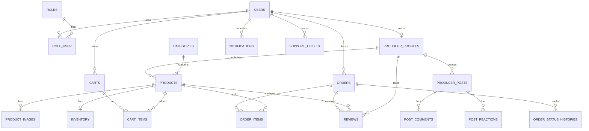

# Diseño de Base de Datos Completo - Mercado Ahora

## 1. Objetivo

Este documento define el diseño completo inicial de base de datos para Mercado Ahora, considerando Fase 1, Fase 2, Fase 3 y extensiones futuras.

La base se diseña en PostgreSQL y prioriza integridad, relaciones claras, crecimiento por módulos y facilidad para construir API REST.

## 2. Convenciones

- Llave primaria: `id` tipo bigint o uuid según decisión final.
- Timestamps: `created_at`, `updated_at`.
- Borrado lógico: `deleted_at` cuando sea útil.
- Estados: campos `status` con valores controlados.
- Relaciones con claves foráneas.
- Índices para búsquedas frecuentes.
- Campos monetarios en enteros menores o decimal controlado. Para Argentina se recomienda `decimal(12,2)` en MVP.

## 3. Dominios de datos

| Dominio | Tablas |
|---|---|
| Identidad | users, roles, role_user, producer_profiles |
| Catálogo | categories, products, product_images, inventory |
| Comercio | carts, cart_items, orders, order_items, order_status_histories, return_requests |
| Comunicación | conversations, messages, offers futuras |
| Confianza | reviews, review_images |
| Operación | notifications, notification_events, support_tickets, support_messages |
| Comunidad | followers, producer_posts, post_images, post_comments, post_reactions |
| Pagos | payment_intents, payment_transactions, payment_webhook_events |
| Wallet futura | wallets, wallet_movements, wallet_withdrawals, solo como reserva de arquitectura |

## 4. Tablas de identidad

### users

| Campo | Tipo | Descripción |
|---|---|---|
| id | bigint | PK |
| name | varchar(150) | Nombre de usuario |
| email | varchar(180) | Email único |
| email_verified_at | timestamp nullable | Fecha de verificación |
| phone | varchar(40) nullable | Teléfono |
| phone_verified_at | timestamp nullable | Verificación futura |
| password | varchar | Password hasheado |
| status | varchar(30) | active, suspended, deleted |
| last_login_at | timestamp nullable | Último acceso |
| created_at | timestamp | Creación |
| updated_at | timestamp | Actualización |
| deleted_at | timestamp nullable | Borrado lógico |

Índices:

- unique(email)
- index(status)
- index(phone)

### roles

| Campo | Tipo | Descripción |
|---|---|---|
| id | bigint | PK |
| name | varchar(50) | admin, seller, buyer |
| description | varchar(255) nullable | Descripción |
| created_at | timestamp | Creación |
| updated_at | timestamp | Actualización |

Índices:

- unique(name)

### role_user

| Campo | Tipo | Descripción |
|---|---|---|
| id | bigint | PK |
| user_id | bigint | FK users |
| role_id | bigint | FK roles |
| created_at | timestamp | Creación |

Índices:

- unique(user_id, role_id)

### producer_profiles

| Campo | Tipo | Descripción |
|---|---|---|
| id | bigint | PK |
| user_id | bigint | FK users |
| business_name | varchar(180) | Nombre del negocio/productor |
| slug | varchar(180) | URL pública |
| city | varchar(120) | Ciudad |
| province | varchar(120) | Provincia |
| country | varchar(80) | Argentina |
| description | text nullable | Descripción corta |
| story | text nullable | Historia del productor |
| production_practices | text nullable | Forma de producción |
| profile_image_path | varchar nullable | Foto principal |
| cover_image_path | varchar nullable | Imagen portada |
| is_verified | boolean | Verificación interna |
| status | varchar(30) | pending, active, paused, rejected |
| created_at | timestamp | Creación |
| updated_at | timestamp | Actualización |
| deleted_at | timestamp nullable | Borrado lógico |

Índices:

- unique(user_id)
- unique(slug)
- index(city, province)
- index(status)

## 5. Tablas de catálogo y productos

### categories

| Campo | Tipo | Descripción |
|---|---|---|
| id | bigint | PK |
| parent_id | bigint nullable | FK categories para subcategorías |
| name | varchar(150) | Nombre |
| slug | varchar(180) | URL |
| description | text nullable | Descripción |
| image_path | varchar nullable | Imagen |
| icon | varchar nullable | Icono |
| sort_order | integer | Orden |
| is_active | boolean | Activa/inactiva |
| created_at | timestamp | Creación |
| updated_at | timestamp | Actualización |

Índices:

- unique(slug)
- index(parent_id)
- index(is_active)

### products

| Campo | Tipo | Descripción |
|---|---|---|
| id | bigint | PK |
| producer_profile_id | bigint | FK producer_profiles |
| category_id | bigint | FK categories |
| name | varchar(200) | Nombre |
| slug | varchar(220) | URL |
| short_description | varchar(500) nullable | Resumen |
| description | text | Descripción completa |
| price | decimal(12,2) | Precio |
| currency | varchar(10) | ARS |
| unit | varchar(50) nullable | kg, unidad, frasco, bolsa |
| production_type | varchar(80) nullable | orgánico, agroecológico, artesanal |
| origin_city | varchar(120) nullable | Origen |
| origin_province | varchar(120) nullable | Provincia |
| delivery_options | json nullable | Envío/retiro/punto entrega |
| ecoscore | varchar(30) nullable | light_green, green, yellow, orange, red |
| ecoscore_notes | text nullable | Justificación |
| ecoscore_points | smallint nullable | Puntaje 0 a 100 para MVP |
| status | varchar(30) | draft, pending_review, active, paused, rejected |
| visibility | varchar(30) | public, private |
| published_at | timestamp nullable | Fecha publicación |
| created_at | timestamp | Creación |
| updated_at | timestamp | Actualización |
| deleted_at | timestamp nullable | Borrado lógico |

Índices:

- unique(slug)
- index(producer_profile_id)
- index(category_id)
- index(status)
- index(price)
- index(production_type)
- index(ecoscore)
- index(origin_city, origin_province)

### product_images

| Campo | Tipo | Descripción |
|---|---|---|
| id | bigint | PK |
| product_id | bigint | FK products |
| path | varchar | Ruta de imagen |
| alt_text | varchar nullable | Texto alternativo |
| sort_order | integer | Orden |
| is_primary | boolean | Imagen principal |
| created_at | timestamp | Creación |
| updated_at | timestamp | Actualización |

Índices:

- index(product_id)
- index(product_id, is_primary)

### inventory

| Campo | Tipo | Descripción |
|---|---|---|
| id | bigint | PK |
| product_id | bigint | FK products |
| stock_quantity | integer | Stock disponible |
| reserved_quantity | integer | Stock reservado |
| availability_status | varchar(40) | in_stock, out_of_stock, made_to_order |
| available_from | date nullable | Disponible desde |
| created_at | timestamp | Creación |
| updated_at | timestamp | Actualización |

Índices:

- unique(product_id)
- index(availability_status)

## 6. Tablas de carrito y pedidos

### carts

| Campo | Tipo | Descripción |
|---|---|---|
| id | bigint | PK |
| user_id | bigint | FK users |
| status | varchar(30) | active, converted, abandoned |
| created_at | timestamp | Creación |
| updated_at | timestamp | Actualización |

Índices:

- index(user_id, status)

### cart_items

| Campo | Tipo | Descripción |
|---|---|---|
| id | bigint | PK |
| cart_id | bigint | FK carts |
| product_id | bigint | FK products |
| quantity | integer | Cantidad |
| note | varchar(300) nullable | Nota |
| created_at | timestamp | Creación |
| updated_at | timestamp | Actualización |

Índices:

- unique(cart_id, product_id)
- index(product_id)

### orders

| Campo | Tipo | Descripción |
|---|---|---|
| id | bigint | PK |
| order_number | varchar(40) | Ej: MA-2026-000001 |
| buyer_id | bigint | FK users |
| status | varchar(40) | pending, confirmed, preparing, shipped, delivered, cancelled, returned |
| payment_status | varchar(40) | pending, approved, rejected, refunded |
| delivery_type | varchar(50) | delivery, pickup_point, producer_pickup |
| delivery_address | json nullable | Dirección |
| buyer_note | varchar(500) nullable | Nota |
| subtotal | decimal(12,2) | Subtotal |
| shipping_total | decimal(12,2) | Envío |
| discount_total | decimal(12,2) | Descuento |
| total | decimal(12,2) | Total |
| currency | varchar(10) | ARS |
| placed_at | timestamp nullable | Fecha compra |
| created_at | timestamp | Creación |
| updated_at | timestamp | Actualización |

Índices:

- unique(order_number)
- index(buyer_id)
- index(status)
- index(payment_status)
- index(created_at)

### order_items

| Campo | Tipo | Descripción |
|---|---|---|
| id | bigint | PK |
| order_id | bigint | FK orders |
| product_id | bigint nullable | FK products |
| producer_profile_id | bigint | FK producer_profiles |
| product_name_snapshot | varchar(200) | Nombre al comprar |
| unit_price_snapshot | decimal(12,2) | Precio al comprar |
| quantity | integer | Cantidad |
| subtotal | decimal(12,2) | Subtotal |
| created_at | timestamp | Creación |
| updated_at | timestamp | Actualización |

Índices:

- index(order_id)
- index(product_id)
- index(producer_profile_id)

### order_status_histories

| Campo | Tipo | Descripción |
|---|---|---|
| id | bigint | PK |
| order_id | bigint | FK orders |
| status | varchar(40) | Estado aplicado |
| note | text nullable | Nota interna o visible |
| changed_by | bigint nullable | FK users |
| created_at | timestamp | Fecha cambio |

Índices:

- index(order_id)
- index(status)

### return_requests

| Campo | Tipo | Descripción |
|---|---|---|
| id | bigint | PK |
| order_id | bigint | FK orders |
| user_id | bigint | FK users |
| reason | text | Motivo |
| status | varchar(40) | requested, approved, rejected, completed |
| admin_note | text nullable | Resolución |
| created_at | timestamp | Creación |
| updated_at | timestamp | Actualización |

Índices:

- index(order_id)
- index(user_id)
- index(status)

## 7. Tablas de comunicación

### conversations

| Campo | Tipo | Descripción |
|---|---|---|
| id | bigint | PK |
| buyer_id | bigint | FK users |
| producer_profile_id | bigint | FK producer_profiles |
| product_id | bigint nullable | FK products |
| status | varchar(30) | open, closed |
| last_message_at | timestamp nullable | Último mensaje |
| created_at | timestamp | Creación |
| updated_at | timestamp | Actualización |

Índices:

- index(buyer_id)
- index(producer_profile_id)
- index(product_id)
- index(last_message_at)

### messages

| Campo | Tipo | Descripción |
|---|---|---|
| id | bigint | PK |
| conversation_id | bigint | FK conversations |
| sender_id | bigint | FK users |
| type | varchar(30) | text, image, system |
| body | text nullable | Mensaje |
| attachment_path | varchar nullable | Archivo |
| read_at | timestamp nullable | Lectura |
| created_at | timestamp | Creación |

Índices:

- index(conversation_id, created_at)
- index(sender_id)
- index(read_at)

### offers

| Campo | Tipo | Descripción |
|---|---|---|
| id | bigint | PK |
| conversation_id | bigint | FK conversations |
| product_id | bigint | FK products |
| buyer_id | bigint | FK users |
| producer_profile_id | bigint | FK producer_profiles |
| price | decimal(12,2) | Precio ofertado |
| quantity | integer | Cantidad |
| message | text nullable | Mensaje |
| status | varchar(40) | pending, accepted, rejected, countered, expired |
| created_at | timestamp | Creación |
| updated_at | timestamp | Actualización |

Índices:

- index(conversation_id)
- index(status)

## 8. Tablas de reseñas

### reviews

| Campo | Tipo | Descripción |
|---|---|---|
| id | bigint | PK |
| user_id | bigint | FK users |
| product_id | bigint | FK products |
| producer_profile_id | bigint | FK producer_profiles |
| order_id | bigint | FK orders |
| product_rating | smallint nullable | 1 a 5 |
| producer_rating | smallint nullable | 1 a 5 |
| comment | text nullable | Comentario |
| status | varchar(30) | published, hidden, reported |
| created_at | timestamp | Creación |
| updated_at | timestamp | Actualización |

Índices:

- unique(user_id, product_id, order_id)
- index(product_id)
- index(producer_profile_id)
- index(status)

### review_images

| Campo | Tipo | Descripción |
|---|---|---|
| id | bigint | PK |
| review_id | bigint | FK reviews |
| path | varchar | Imagen |
| created_at | timestamp | Creación |

Índices:

- index(review_id)

## 9. Tablas de notificaciones

### notifications

| Campo | Tipo | Descripción |
|---|---|---|
| id | bigint | PK |
| user_id | bigint | FK users |
| type | varchar(60) | order, chat, support, community, system |
| title | varchar(180) | Título |
| body | varchar(500) nullable | Descripción |
| data | json nullable | Datos extra |
| read_at | timestamp nullable | Lectura |
| created_at | timestamp | Creación |

Índices:

- index(user_id, read_at)
- index(type)
- index(created_at)

### notification_events

| Campo | Tipo | Descripción |
|---|---|---|
| id | bigint | PK |
| event_type | varchar(80) | Tipo de evento |
| source_type | varchar(120) | Modelo origen |
| source_id | bigint | ID origen |
| payload | json nullable | Payload |
| created_at | timestamp | Creación |

Índices:

- index(event_type)
- index(source_type, source_id)

## 10. Tablas de soporte

### support_tickets

| Campo | Tipo | Descripción |
|---|---|---|
| id | bigint | PK |
| user_id | bigint | FK users |
| subject | varchar(200) | Asunto |
| status | varchar(40) | open, in_progress, resolved |
| priority | varchar(30) | low, normal, high |
| created_at | timestamp | Creación |
| updated_at | timestamp | Actualización |

Índices:

- index(user_id)
- index(status)

### support_messages

| Campo | Tipo | Descripción |
|---|---|---|
| id | bigint | PK |
| ticket_id | bigint | FK support_tickets |
| sender_id | bigint | FK users |
| sender_type | varchar(30) | user, support, admin |
| message | text | Mensaje |
| created_at | timestamp | Creación |

Índices:

- index(ticket_id, created_at)

## 11. Tablas de comunidad

### followers

| Campo | Tipo | Descripción |
|---|---|---|
| id | bigint | PK |
| user_id | bigint | FK users |
| producer_profile_id | bigint | FK producer_profiles |
| created_at | timestamp | Creación |

Índices:

- unique(user_id, producer_profile_id)
- index(producer_profile_id)

### producer_posts

| Campo | Tipo | Descripción |
|---|---|---|
| id | bigint | PK |
| producer_profile_id | bigint | FK producer_profiles |
| product_id | bigint nullable | Producto relacionado |
| title | varchar(180) nullable | Título |
| body | text | Contenido |
| status | varchar(30) | draft, published, hidden |
| published_at | timestamp nullable | Publicación |
| created_at | timestamp | Creación |
| updated_at | timestamp | Actualización |

Índices:

- index(producer_profile_id)
- index(product_id)
- index(status, published_at)

### post_images

| Campo | Tipo | Descripción |
|---|---|---|
| id | bigint | PK |
| post_id | bigint | FK producer_posts |
| path | varchar | Imagen |
| sort_order | integer | Orden |
| created_at | timestamp | Creación |

Índices:

- index(post_id)

### post_comments

| Campo | Tipo | Descripción |
|---|---|---|
| id | bigint | PK |
| post_id | bigint | FK producer_posts |
| user_id | bigint | FK users |
| body | text | Comentario |
| status | varchar(30) | visible, hidden |
| created_at | timestamp | Creación |
| updated_at | timestamp | Actualización |

Índices:

- index(post_id, created_at)
- index(user_id)

### post_reactions

| Campo | Tipo | Descripción |
|---|---|---|
| id | bigint | PK |
| post_id | bigint | FK producer_posts |
| user_id | bigint | FK users |
| reaction_type | varchar(40) | apoyar, recomendar, me_interesa |
| created_at | timestamp | Creación |

Índices:

- unique(post_id, user_id, reaction_type)
- index(reaction_type)

## 12. Tablas de pagos

En Fase 1 estas tablas representan preparación estructural. No implican integración completa con Mercado Pago dentro del MVP.

### payment_intents

| Campo | Tipo | Descripción |
|---|---|---|
| id | bigint | PK |
| order_id | bigint | FK orders |
| provider | varchar(50) | mercado_pago, internal_wallet, manual |
| status | varchar(40) | pending, processing, approved, rejected, cancelled |
| amount | decimal(12,2) | Monto |
| currency | varchar(10) | ARS |
| provider_reference | varchar nullable | ID externo |
| metadata | json nullable | Datos adicionales |
| created_at | timestamp | Creación |
| updated_at | timestamp | Actualización |

Índices:

- index(order_id)
- index(provider, status)
- index(provider_reference)

### payment_transactions

| Campo | Tipo | Descripción |
|---|---|---|
| id | bigint | PK |
| payment_intent_id | bigint | FK payment_intents |
| transaction_type | varchar(40) | charge, refund, adjustment |
| status | varchar(40) | pending, approved, failed |
| amount | decimal(12,2) | Monto |
| provider_payload | json nullable | Respuesta proveedor |
| created_at | timestamp | Creación |

Índices:

- index(payment_intent_id)
- index(status)

### payment_webhook_events

| Campo | Tipo | Descripción |
|---|---|---|
| id | bigint | PK |
| provider | varchar(50) | Proveedor |
| event_id | varchar nullable | ID externo |
| event_type | varchar(100) | Tipo |
| payload | json | Payload original |
| processed_at | timestamp nullable | Procesado |
| created_at | timestamp | Creación |

Índices:

- index(provider, event_type)
- index(processed_at)

## 13. Tablas para wallet futura

Estas tablas son futuras únicamente. No deben crearse ni activarse en el MVP salvo que el alcance cambie. Se documentan para reservar el camino arquitectónico de una wallet interna sin modificar el núcleo de pedidos.

### wallets

| Campo | Tipo | Descripción |
|---|---|---|
| id | bigint | PK |
| user_id | bigint | FK users |
| balance | decimal(12,2) | Saldo |
| currency | varchar(10) | ARS |
| status | varchar(40) | active, frozen, closed |
| created_at | timestamp | Creación |
| updated_at | timestamp | Actualización |

### wallet_movements

| Campo | Tipo | Descripción |
|---|---|---|
| id | bigint | PK |
| wallet_id | bigint | FK wallets |
| type | varchar(40) | credit, debit, refund, withdrawal |
| amount | decimal(12,2) | Monto |
| reference_type | varchar nullable | order, payment, withdrawal |
| reference_id | bigint nullable | ID relacionado |
| description | varchar(255) nullable | Descripción |
| created_at | timestamp | Creación |

### wallet_withdrawals

| Campo | Tipo | Descripción |
|---|---|---|
| id | bigint | PK |
| wallet_id | bigint | FK wallets |
| amount | decimal(12,2) | Monto |
| status | varchar(40) | requested, processing, paid, rejected |
| bank_data | json nullable | Datos de pago |
| created_at | timestamp | Creación |
| updated_at | timestamp | Actualización |

## 14. Relaciones principales

## 15. Recomendaciones de implementación

- Crear primero tablas de identidad, roles, perfiles, categorías y productos.
- No agregar wallet en MVP como funcionalidad activa.
- Las tablas de wallet son de referencia futura y no forman parte de la entrega Phase 1.
- Mantener `payment_intents` y `payment_transactions` para no rehacer órdenes después.
- Usar snapshots en `order_items` para que cambios futuros de producto no rompan pedidos antiguos.
- Usar paginación en productos, reseñas, mensajes, notificaciones y publicaciones.
- Agregar índices desde el principio en campos de filtros y relaciones.

## 16. EcoScore MVP

El MVP usa una fórmula simple de 0 a 100 puntos.

| Criterio | Puntaje |
|---|---:|
| Producción natural o agroecológica | 25 |
| Producción local / regional | 20 |
| Empaque reciclable o reutilizable | 20 |
| Entrega de bajo impacto o entrega local | 15 |
| Perfil del productor completo y transparente | 20 |

Rangos:

- 80 a 100: EcoScore Alto.
- 50 a 79: EcoScore Medio.
- 0 a 49: EcoScore Básico.

Campos recomendados en `products`:

- ecoscore_points.
- ecoscore.
- ecoscore_notes.

## 17. Categorías iniciales MVP

Seed inicial sugerido para `categories`:

| Categoría | Ejemplos |
|---|---|
| Alimentos naturales | miel, mermeladas, conservas, frutos secos, granos |
| Huerta y productos frescos | frutas, verduras, huevos, plantas aromáticas |
| Bebidas naturales | tés, infusiones, jugos naturales |
| Cosmética natural | jabones, cremas, aceites esenciales |
| Bienestar y salud natural | productos herbales, suplementos naturales |
| Hogar sostenible | productos reutilizables, limpieza ecológica |
| Artesanías y productos regionales | productos hechos a mano, madera, cerámica, textiles |
| Mascotas naturales | alimentos y accesorios naturales para mascotas |

## 18. Ajustes de base de datos por feedback del cliente

### Producer Profile

Campos recomendados para reforzar postulación, historia y confianza:

- `production_origin`: producción propia, reventa o mixto.
- `product_types`: tipos de productos ofrecidos.
- `production_method`: natural, artesanal, agroecológico, regional u otro.
- `production_since`: trayectoria aproximada.
- `story`: historia del emprendimiento.
- `digital_presence_notes`: notas iniciales sobre presencia digital o fotos del proceso.
- `approved_by`, `approved_at`, `approval_notes`, `rejection_reason`: revisión administrativa.

### Producer Social Links

Tabla preparada para presencia digital futura:

- `producer_social_links`.
- `producer_profile_id`.
- `platform`.
- `url`.
- `is_visible`.

### Product EcoScore Validation

Campos recomendados:

- `ecoscore_status`.
- `ecoscore_validated_by`.
- `ecoscore_validated_at`.
- `ecoscore_validation_notes`.

### Chat Attachments

Tabla futura para imágenes en chat:

- `message_attachments`.
- `message_id`.
- `type`.
- `path`.
- `mime_type`.
- `size_bytes`.

### Checkout por productor

No requiere una tabla nueva obligatoria. La separación se logra agrupando `cart_items` por `product.producer_profile_id` y generando una orden por productor durante checkout.
